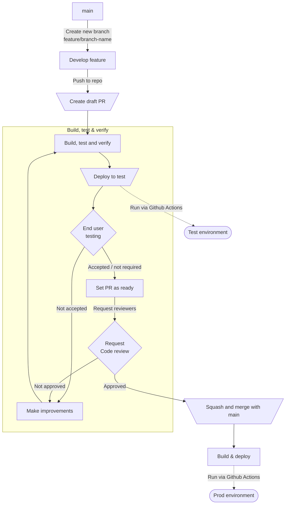

# Contributing

This repo uses [Trunk based development](https://trunkbaseddevelopment.com/) along with [Conventional commits](https://www.conventionalcommits.org/en/v1.0.0/). When making contributions follow this checklist:

- Ensure you have created an issue in Github Issues
- Create a new feature branch from the `main` branch
- Implement
- Submit a draft PR
- Perform a self-review of your code and ensure all CI is run before submitting the PR for approval.

## Structuring the code

Each application will have a corresponding library placed under the `libs` folder. In addition, common code should be put inside the `shared` library.

The naming convention for a app library should be `<appname>app` i.e. `handoverapp`. An app library contains specific utilities, components and configuration for the application.

An app library cannot import modules from other app libraries and an app cannot import modules from a different app library than its own.
If there are common modules across libraries/apps, then it should probably be put under the `shared` library where everyone can consume from.

## How we work

The following chart describes the development workflow for the lighouse team.

