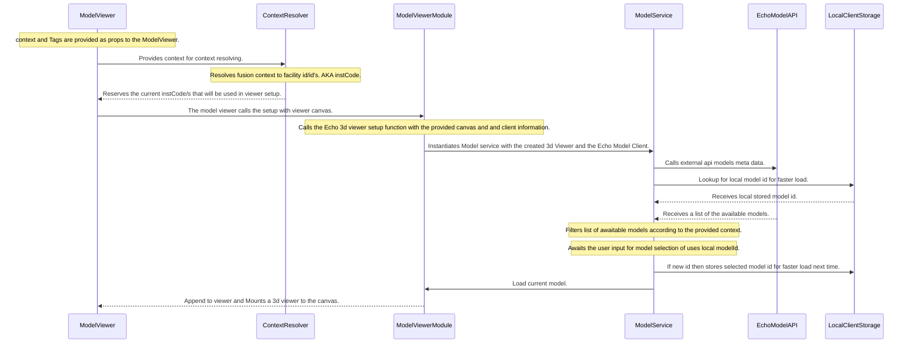

# Fusion Move Viewer

> Powered by Echo 3d Viewer and Reveal

### Model Loading

The following diagram shows the internal code journey to load a model in the model.



Get details about a clicked 3D element
```ts

  useEffect(() => {
    const callback = async (e: Event) => {
      const index = (e as Test).detail.treeIndex;

      const data = selectionControls.getNodeFromTreeId(index);
      console.log({ data });
    };

    window.addEventListener('selectionStarted', callback);

    return () => {
      window.removeEventListener('selectionStarted', callback);
    };
  }, [selectionControls]);
```

